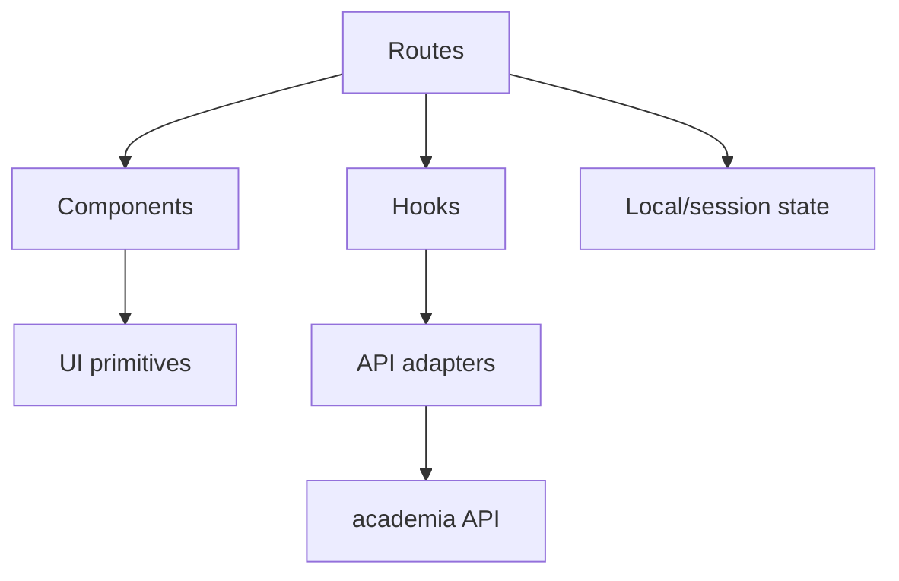

# Frontend Architecture

المشروع يستخدم React + TypeScript + Vite مع TanStack Router/Start وTailwind CSS ومكونات UI مبنية على Radix/shadcn-style primitives.

## قواعد الطبقات

- `src/routes`: تركيب الشاشة، route metadata، وnavigation.
- `src/components/ui`: مكونات عامة لا تعرف business domain.
- `src/components/app`: مكونات مشتركة للبيانات واللوحات.
- `src/components/site`: shell العام والمصادقة والمحتوى العام.
- `src/hooks`: اشتقاق state والتفاعل مع lifecycle.
- `src/integrations/backend`: client وauth adapters.
- `src/lib`: types وhelpers وserver functions المؤقتة.

لا تنقل business rule إلى primitive، ولا تستدعِ endpoint خارجيًا من كل component بصورة مختلفة.
